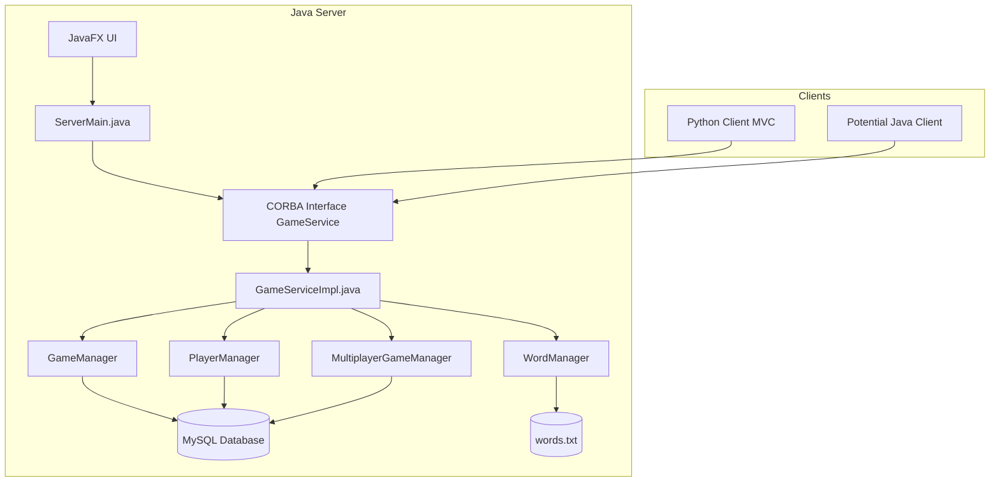

# Codebase Analysis: Hangman Game

This document provides a comprehensive analysis of the Hangman game codebase from the perspectives of a software architect, a software developer, and a product manager.

## 1. Software Architect Perspective

### 1.1. Overall Architecture

The Hangman game employs a **client-server architecture**.

*   **Server:** Implemented in Java, using CORBA for communication with clients. It features a JavaFX-based GUI for server management and logging.
*   **Clients:**
    *   A Python client using an MVC (Model-View-Controller) pattern.
    *   Evidence of a potential Java-based client (`client/player` and `src/main/java/client` directories).

The server itself is well-structured, with distinct packages for handling database interactions (`db`), data transfer objects (`dto`), request handlers (`handler`), and controllers (`controller`).



### 1.2. Key Technologies

*   **Java:** Core language for the server-side implementation.
*   **CORBA (Common Object Request Broker Architecture):** Used for communication between the Java server and clients. This is indicated by `GameService.idl` (implied), generated stub/skeleton classes (`_GameServiceStub.java`, `GameServicePOA.java`), and ORB initialization in `ServerMain.java`.
*   **JavaFX:** Used for the server's graphical user interface.
*   **Python:** Used for one of the client implementations.
*   **Tkinter (likely):** The Python client's `views.main_view` likely uses Tkinter for the GUI, a standard Python library.
*   **MySQL:** Database used for storing player data, game history, and potentially other persistent information. (Seen in `GameServiceImpl.java` JDBC connection strings).
*   **Maven:** Build automation tool for the Java project, managing dependencies and the build process.
*   **Gson:** Java library for serializing and deserializing Java objects to/from JSON, used for match history and potentially other data exchanges.

### 1.3. Communication Flow

1.  **Server Initialization:**
    *   `ServerMain.java` initializes the JavaFX application for the server UI.
    *   It then initializes the CORBA ORB (Object Request Broker).
    *   An instance of `GameServiceImpl` (which implements the `GameService` IDL interface) is created and registered with the CORBA Naming Service.
    *   The server then waits for client connections and requests.

2.  **Client Connection (Conceptual):**
    *   Clients (Python or Java) would use CORBA to look up the `GameService` object registered by the server.
    *   Once a reference to the remote `GameService` object is obtained, clients can invoke methods on it (e.g., `login`, `startGame`, `sendGuess`).

3.  **Gameplay Example (Single Player):**
    ```mermaid
    sequenceDiagram
        participant C as Client
        participant S as Server (GameServiceImpl)
        participant GM as GameManager
        participant PM as PlayerManager
        participant WM as WordManager

        C->>S: login(username, password)
        S->>PM: login(username, password)
        PM-->>S: success/failure
        S-->>C: loginResponse

        C->>S: startGame(username)
        S->>GM: startGame(username)
        GM->>WM:getRandomWord()
        WM-->>GM: word
        GM->>PM: updatePlayerState(username, newGame)
        GM-->>S: gameId / initialGameState
        S-->>C: gameState (maskedWord, etc.)

        loop Game Round
            C->>S: sendGuess(username, letter)
            S->>GM: sendGuess(username, letter)
            GM->>PM: updatePlayerGuesses(username, letter)
            alt Guess is correct
                GM-->>S: updatedGameState (newMaskedWord)
            else Guess is incorrect
                GM-->>S: updatedGameState (attemptsLeft--)
            end
            S-->>C: gameStateUpdate
        end
        C->>S: endGameSession(username)
        S->>GM: endGameSession(username)
        GM->>PM: recordGameResult(username)
        GM-->>S: finalResult
        S-->>C: finalResult
    ```

### 1.4. Data Management

*   **Player Data:** Managed by `PlayerManager` and stored in the MySQL database. This includes credentials, wins, and potentially other statistics.
*   **Word List:** Managed by `WordManager`, likely loaded from `words.txt`. Provides words for the game.
*   **Game State:**
    *   Single-player game state managed by `GameManager`.
    *   Multiplayer game state managed by `MultiplayerGameManager`.
    *   `GameStateDTO` is used to transfer game state information.
*   **Match History:** Stored in the MySQL database, accessible via `MatchResultDAO` and `SinglePlayerMatchResultDAO`.

### 1.5. Scalability and Reliability

*   **Scalability:**
    *   The current CORBA-based architecture might face scalability challenges under very high load compared to more modern solutions like REST APIs with stateless services.
    *   Database performance could become a bottleneck.
    *   The single server instance is a single point of failure.
*   **Reliability:**
    *   CORBA itself is a mature technology.
    *   Error handling seems present (e.g., `AlreadyLoggedInException`), but a full review would be needed.
    *   The server's reliance on a local MySQL database means database availability is critical.

### 1.6. Security Considerations (Initial Thoughts)

*   **Authentication:** Basic username/password authentication is in place. Password storage security (hashing, salting) in the database is crucial and should be verified.
*   **Data Transmission:** CORBA can be configured for secure transmission (e.g., SSL/TLS), but it's unclear from the current information if this is implemented. If not, sensitive data like passwords could be transmitted in plaintext.
*   **Input Validation:** Server-side input validation is critical to prevent injection attacks or unexpected behavior.
*   **Database Security:** SQL injection prevention in `MatchResultDAO` and other database interaction points is important.

## 2. Software Developer Perspective

### 2.1. Code Structure and Organization

*   **Server (Java):**
    *   Follows a clear, modular structure (`controller`, `handler`, `dto`, `db`).
    *   `GameServiceImpl.java` is quite large (over 500 lines) and handles many responsibilities. It acts as the main entry point for all game-related CORBA calls. While it delegates to other managers (`GameManager`, `PlayerManager`, `MultiplayerGameManager`), it still contains a lot of direct logic for data transformation (DTO mapping) and orchestrating calls for multiplayer lobby state. Consider refactoring some of this logic into more specialized classes if complexity grows.
    *   The use of DTOs (`GameStateDTO`, `LeaderboardEntryDTO`, etc.) is good practice for separating service layer data from internal representations.
    *   Database access is encapsulated in DAO classes (`MatchResultDAO`, `SinglePlayerMatchResultDAO`).
*   **Python Client:**
    *   Uses an MVC pattern, which is good for separating concerns (UI, logic, data).
    *   `app.py` provides a clear entry point.

### 2.2. Key Modules and Responsibilities

*   **`ServerMain.java`:** Initializes server UI (JavaFX), CORBA ORB, and registers `GameServiceImpl`.
*   **`GameServiceImpl.java`:** The heart of the server. Implements `GameServicePOA` (CORBA skeleton). Handles all client requests, delegating to:
    *   **`PlayerManager.java`:** Manages player accounts (login, creation, deletion, updates), settings, leaderboard, and system statistics. Interacts with the database.
    *   **`WordManager.java`:** Manages the list of words for the game (add, update, delete, retrieve). Reads from `words.txt`.
    *   **`GameManager.java`:** Manages the logic for single-player Hangman games (starting games, processing guesses, tracking game state, rounds, time).
    *   **`MultiplayerGameManager.java`:** Manages multiplayer lobbies and game state, including player queuing, round synchronization, and scoring.
    *   **`MatchResultDAO.java` / `SinglePlayerMatchResultDAO.java`:** Handles database operations for storing and retrieving match history.
*   **`python_client/`:**
    *   **`app.py`:** Initializes and starts the Python client application.
    *   **`models/game_model.py`:** (Expected) Handles client-side game state, communication with the server (via CORBA), and game logic.
    *   **`views/main_view.py`:** (Expected) Contains the `HangmanApp` class, responsible for the GUI (likely Tkinter).
    *   **`controllers/game_controller.py`:** (Expected) Mediates between the view and the model, handling user input and updating the view.
*   **`GameModule/` (and `idl/`):** Contains CORBA-generated files based on an IDL definition (e.g., `GameService.idl`). These define the contract between server and client.

### 2.3. Build and Dependencies (`pom.xml`)

*   Java 8 project.
*   Dependencies include:
    *   `mysql-connector-java`: For MySQL database connectivity.
    *   `gson`: For JSON processing (used in `GameServiceImpl` for match history).
    *   `AnimateFX`: For JavaFX animations.
    *   `junit`: For unit testing.
*   Standard Maven compiler plugin is used.

### 2.4. Potential Areas for Improvement / Refactoring

*   **`GameServiceImpl.java`:** As mentioned, this class is very long. Some of its responsibilities, especially the JSON string building for `getMultiplayerLobbyState`, could be moved to dedicated DTOs or helper classes to improve readability and maintainability. Using Gson for serialization here, similar to how it's used for match history, would be more robust than manual string building.
*   **Error Handling:** Ensure consistent and comprehensive error handling throughout the application, both on the server and client sides.
*   **Configuration Management:** Database connection details and other settings (e.g., CORBA port, Naming Service name) appear hardcoded in `GameServiceImpl.java`. Externalize these into configuration files.
*   **Testing:** `pom.xml` includes JUnit. Comprehensive unit and integration tests are crucial, especially for game logic, player management, and CORBA interactions.
*   **Logging:** `GameServiceImpl` has a `logCallback` for the server UI. Consider integrating a more robust logging framework (e.g., Log4j, SLF4j) for better log management, different log levels, and configurable output (file, console).
*   **Python Client CORBA Interaction:** The details of how the Python client interacts with CORBA (e.g., using a library like `omniORBpy`) are not visible but are critical for its functionality.

### 2.5. Developer Onboarding

*   Understanding CORBA concepts will be necessary for developers working on client-server communication.
*   The Java server code is reasonably well-structured, making it easier to understand specific modules.
*   The Python client's MVC structure should also be familiar to many developers.
*   Setting up the development environment (Java, Maven, Python, MySQL, CORBA ORB) will be the first step.
*   The `run_server.bat` and `run_client.bat` scripts are helpful for starting the application.

## 3. Product Manager Perspective

### 3.1. Core Product Features

*   **Single-Player Hangman Game:**
    *   Player login and account creation.
    *   Start new game.
    *   Guess letters.
    *   Track incorrect guesses.
    *   Masked word display.
    *   Round management (current round, total rounds).
    *   Win/loss tracking.
    *   Remaining time for rounds.
*   **Multiplayer Hangman Game:**
    *   Lobby system for players to join.
    *   Synchronized game state across multiple players.
    *   Tracking scores for multiple players.
    *   Round progression for all players in a lobby.
    *   Declaration of round and game winners.
    *   Spectator mode features (viewing all players' masked words, guesses).
*   **Player Management:**
    *   Create, delete, update player accounts (username, password).
*   **Leaderboard:**
    *   View player rankings based on wins.
*   **Word Management (Admin Feature):**
    *   Add, update, delete words in the game's dictionary.
*   **System Settings (Admin Feature):**
    *   Update game parameters like waiting time and round time.
*   **Match History:**
    *   Players can view their past game summaries and details (both single and multiplayer).
*   **Server Administration UI:**
    *   View server logs.
    *   Start/stop the game server.
    *   View active players and games (basic statistics).

### 3.2. Target Audience

*   Casual gamers looking for a classic Hangman experience.
*   Players who enjoy competitive multiplayer word games.
*   Could be used in an educational context.

### 3.3. Potential Strengths

*   **Multiplayer Mode:** Adds a competitive and social dimension, increasing engagement.
*   **Comprehensive Feature Set:** Includes player accounts, leaderboards, match history, and admin functionalities, making it more than just a basic Hangman game.
*   **Clear Separation of Concerns:** The architecture (client-server, MVC in Python client, modular Java server) is a good foundation for future development.

### 3.4. Potential Weaknesses / Areas for Enhancement

*   **User Interface (UI/UX):**
    *   The current state of the UI is unknown beyond the Python client using a generic `HangmanApp` and the server having a JavaFX UI. A modern, appealing, and user-friendly UI is critical for player engagement.
    *   The Python client's `eye.png` suggests some visual elements, but the overall experience needs assessment.
*   **Technology Choice (CORBA):** While functional, CORBA is an older technology. Modern alternatives like REST APIs with WebSockets (for real-time multiplayer) might offer better performance, scalability, and easier integration with web/mobile clients. This could be a long-term consideration.
*   **Accessibility:** No information on accessibility features. Ensuring the game is playable by people with disabilities would broaden its appeal.
*   **Monetization (if applicable):** No current monetization strategy is apparent.
*   **Player Engagement Features:**
    *   Achievements or badges.
    *   Customizable themes or avatars.
    *   Friend systems or social sharing.
*   **Game Balancing (Multiplayer):** Ensure fairness in multiplayer, especially regarding word selection and turn order if applicable. The current system seems to have all players guess the same word simultaneously per round.
*   **Platform Support:** Currently a Java server and a Python client (desktop). Expanding to web or mobile platforms would significantly increase reach. This would likely necessitate a shift away from CORBA for the client-facing API.

### 3.5. Future Product Roadmap Ideas

*   **UI/UX Overhaul:** Invest in modernizing the client UIs for a better player experience.
*   **Web Client:** Develop a web-based client to make the game accessible without installation.
*   **Mobile Clients (iOS/Android):** Expand to mobile platforms.
*   **Advanced Admin Panel:** Enhance the server UI or create a dedicated web admin panel for more detailed analytics, player management, and game configuration.
*   **Themed Word Packs:** Allow players to choose different categories of words (e.g., animals, movies, science).
*   **Game Modes:** Introduce new game modes (e.g., timed challenges, team play).
*   **AI Opponent:** Develop an AI for single-player mode with varying difficulty levels.
*   **Internationalization/Localization:** Support multiple languages.

This analysis provides a foundational understanding of the Hangman game codebase. Further deep dives into specific modules, particularly the client-side implementations and UI, would provide even more detailed insights. 