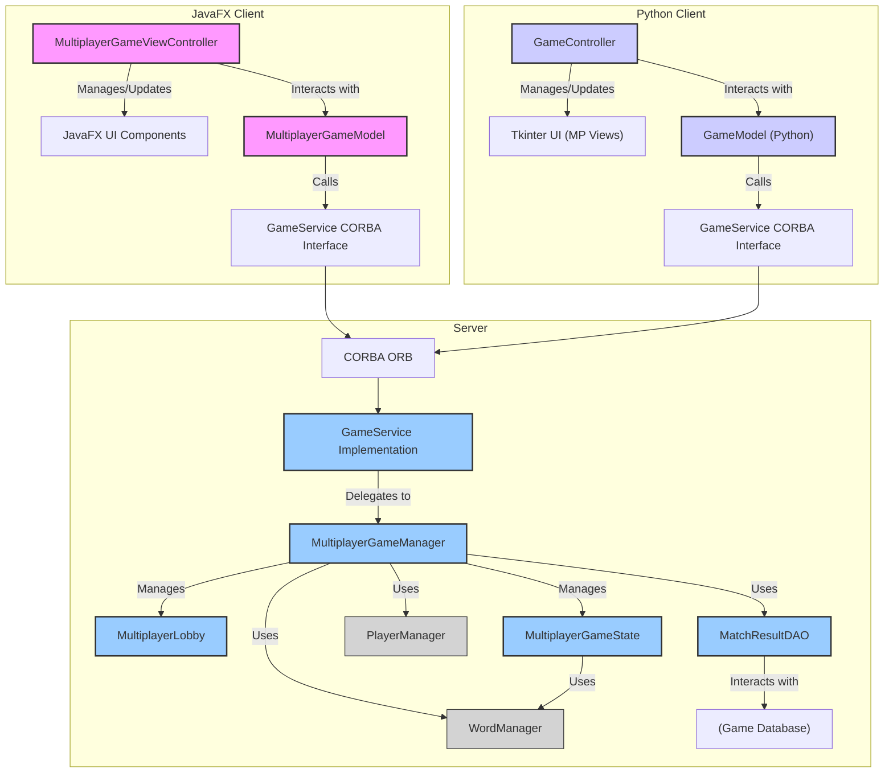
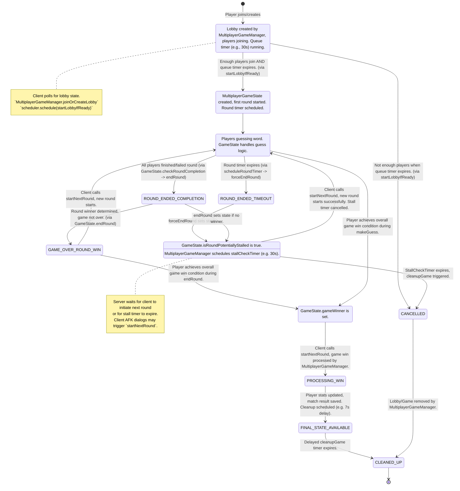
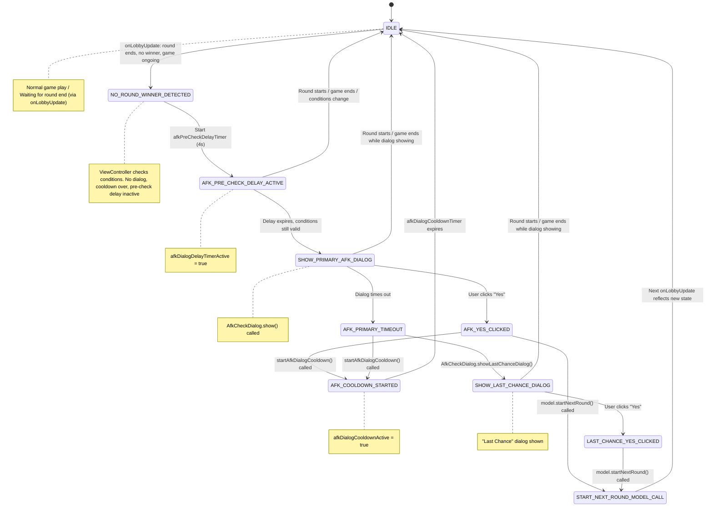
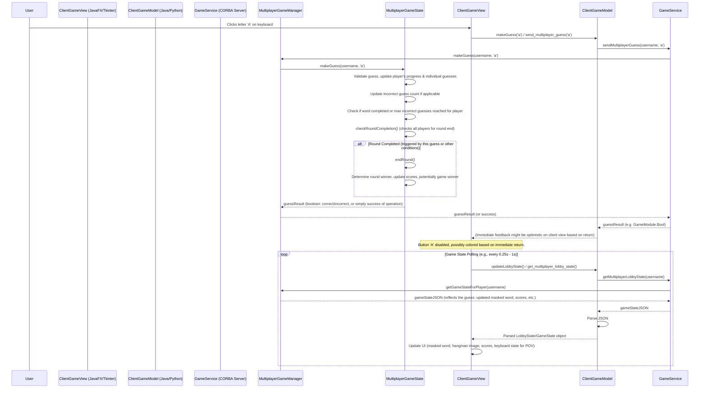

# Hangman Game: Multiplayer Mode Comprehensive Overview

## 1. Introduction

This document provides an in-depth analysis of the multiplayer mode in the Hangman game. It covers the system from multiple perspectives: software architecture, software development, and product management. The multiplayer mode allows multiple players to compete simultaneously in rounds of Hangman, aiming to guess words correctly and accumulate scores to win the game. The system supports clients built with JavaFX and Python (Tkinter), both interacting with a Java-based CORBA server.

## 2. Software Architecture

### 2.1. High-Level Component Diagram

The system is a client-server architecture with a central Java-based server handling game logic and state. Clients (JavaFX or Python) communicate with the server via CORBA.



**Key Components:**

*   **Clients (JavaFX & Python):**
    *   **View:** Renders the game UI (word display, keyboard, scores, timer, status messages, dialogs).
        *   JavaFX: `MultiplayerGameViewController.java`, FXML files.
        *   Python: `MultiplayerQueueView.py`, `MultiplayerGameView.py` in `main_view.py`.
    *   **Model (Client-side):** Manages client-side state, parses data from the server, and makes calls to the `GameService`.
        *   JavaFX: `MultiplayerGameModel.java`.
        *   Python: `game_model.py`.
    *   **Controller (Client-side):** Handles user input, orchestrates updates between View and Model, manages client-side polling loops for state synchronization.
        *   JavaFX: `MultiplayerGameViewController.java` (acts as controller).
        *   Python: `game_controller.py`.
*   **Server (Java):**
    *   **CORBA ORB & GameService Implementation:** Exposes game functionalities via CORBA. The `GameService` IDL defines the contract.
    *   **`MultiplayerGameManager`:** Central component for managing multiplayer lobbies and game lifecycles. It handles player joining, lobby creation, transitioning lobbies to active games, starting rounds, and cleaning up finished games. It also manages timers for queue time, round time, and stall checks.
    *   **`MultiplayerLobby`:** (Inferred concept, likely a class) Represents a waiting area for players before a game starts. Tracks players, min/max player counts, and lobby status.
    *   **`MultiplayerGameState`:** Encapsulates the complete state of an active multiplayer game instance, including players, scores, current word, individual player progress (masked words, guesses), round number, and game/round status.
    *   **`WordManager`:** (Assumed) Responsible for providing words for the game.
    *   **`PlayerManager`:** (Assumed) Manages player-specific data like overall statistics (e.g., total wins).
    *   **`MatchResultDAO`:** Handles database operations for saving match results.
    *   **Game Database:** Stores persistent data like match history and player statistics.

### 2.2. Technology Stack

*   **Server-side:** Java, CORBA (omniORB implied by Python client's `omniORB` import).
*   **JavaFX Client:** Java, JavaFX for UI, CORBA for client-server communication.
*   **Python Client:** Python, Tkinter for UI, CORBA (omniORB) for client-server communication.
*   **Data Serialization:** JSON is used for transmitting complex lobby and game state information from the server to clients over CORBA (as stringified JSON).

### 2.3. Communication Model

*   Clients communicate with the server using CORBA method invocations.
*   Game state synchronization is primarily achieved through client-side polling:
    *   Clients periodically call `getMultiplayerLobbyState()` on the `GameService`.
    *   The server returns a JSON string representing the current lobby/game state.
    *   Clients parse this JSON to update their local models and UI.
*   Polling interval is typically around 250ms to 1 second.

## 3. Server-Side Implementation

### 3.1. `MultiplayerGameManager`

This class is the backbone of the multiplayer mode on the server.

**Responsibilities:**

*   Managing the lifecycle of multiplayer lobbies and games.
*   Handling player requests to join or create lobbies.
*   Starting games when lobbies are ready.
*   Coordinating round progression and timers.
*   Interacting with `PlayerManager` for player stats and `MatchResultDAO` for persisting game results.
*   Handling game cleanup and AFK/stall scenarios.

**Key Mechanisms:**

*   **Lobby Management:**
    *   `joinOrCreateLobby(username)`:
        1.  Attempts to find an existing open lobby.
        2.  If none, creates a new `MultiplayerLobby` with a unique ID.
        3.  Adds the player to the lobby.
        4.  Schedules `startLobbyIfReady()` to run after `queueTimeSeconds`.
    *   `activeLobbies`: A `ConcurrentHashMap` storing active lobbies by `lobbyId`.
*   **Game Initialization:**
    *   `startLobbyIfReady(lobbyId)`:
        1.  Checks if the lobby has enough players (met `minPlayers`).
        2.  If ready:
            *   Marks the lobby as `started`.
            *   Creates a new `MultiplayerGameState` instance.
            *   Stores the game state in `activeGames` (a `ConcurrentHashMap`).
            *   Calls `gameState.startNewRound()` to begin the first round.
            *   Schedules a round timer using `scheduleRoundTimer()`.
        3.  If not ready (e.g., not enough players after queue time):
            *   Removes the lobby from `activeLobbies`. Players in the lobby will see a "NOMATCH" state on their next poll.
*   **Round and Game Timers:**
    *   Uses a `ScheduledExecutorService` for all timed events.
    *   `scheduleRoundTimer(lobbyId)`: Schedules a task to call `gameState.forceEndRound()` when the round time (from `playerManager.getRoundTime()`) expires. If the round ends and is potentially stalled, it schedules a `stallCheckTimer`.
    *   `scheduleStallCheckTimer(lobbyId)`: If a round ends without a clear winner or progression, and clients don't initiate the next round, this timer (e.g., 30 seconds) will trigger `cleanupGame(lobbyId)` to prevent a game from being stuck indefinitely. This timer is cancelled if a guess is made or a new round starts.
*   **Guess Handling:**
    *   `makeGuess(username, letter)`: Retrieves the player's `MultiplayerGameState` and delegates the guess. It also cancels any active `stallCheckTimer` for that lobby, as player activity is detected.
*   **Next Round Initiation:**
    *   `startNextRound(username)` (called by client action, often after an AFK prompt):
        1.  Retrieves the game for the player's lobby.
        2.  If a `gameWinner` is already determined:
            *   Processes the game win (updates player stats via `PlayerManager`, saves match results via `MatchResultDAO`).
            *   Schedules `cleanupGame()` after a short delay (e.g., 7 seconds) to allow clients to fetch the final state.
            *   Uses `game.isGameWinProcessed()` and `cleanupScheduled` set to prevent duplicate processing/cleanup scheduling.
        3.  If no game winner:
            *   Calls `gameState.startNewRound()`.
            *   If the new round starts successfully, it cancels any `stallCheckTimer` and schedules a new `scheduleRoundTimer`.
            *   If the round doesn't start and `gameState.isRoundPotentiallyStalled()` is true, it schedules a `stallCheckTimer`.
*   **Game Cleanup:**
    *   `cleanupGame(lobbyId)`: Removes the lobby from `activeLobbies` and the game from `activeGames`. Cancels associated round timers.
    *   `scheduleCleanupIfGameOver(lobbyId)`: A helper that can be called to schedule cleanup if a game is detected as over.

**Lobby and Game Lifecycle (Server Perspective):**



### 3.2. `MultiplayerGameState`

This class holds and manages the state for a single active multiplayer game.

**Key Data Points:**

*   `lobbyId`, `players` list.
*   `playerScores`, `playerProgress` (StringBuilder for masked words), `playerGuesses` (Set of chars).
*   `playerIncorrectGuesses`, `playerFinishTimes` (timestamp when player finished a word).
*   `playerWinStreaks`, `playerCurrentWords` (actual word for each player, usually the same for all in a round).
*   `currentWord` (the word for the current round).
*   `currentRound` number, `roundInProgress` flag, `roundStartTime`.
*   `roundTimeSeconds` (duration of a round).
*   `roundWinners` (map of round number to winner username).
*   `gameWinner` (username of the overall game winner).
*   `roundResults` (list of `RoundResult` objects for match history).
*   `gameId` (UUID for the match).
*   `matchWords` (list of words for the entire match, shuffled).
*   `gameWinProcessed` (flag to avoid processing win multiple times).
*   `roundPotentiallyStalled` (flag set if a round ends with no winner).

**Core Logic:**

*   **Constructor:** Initializes player-specific maps, shuffles words for the match from `WordManager`.
*   `startNewRound()`:
    *   Increments `currentRound`.
    *   Selects a new `currentWord` from `matchWords`.
    *   Sets `roundInProgress = true`, records `roundStartTime`.
    *   Resets `playerProgress` (masked word), `playerGuesses`, `playerFinishTimes`, `playerMisses` for all players for the new round.
*   `makeGuess(username, letter)`:
    *   Validates if the round is in progress and the player can guess.
    *   Adds letter to `playerGuesses`.
    *   Updates `playerProgress` if the guess is correct.
    *   If incorrect, increments `playerMisses`. If misses reach a limit (e.g., 5), marks player as finished for the round by setting `playerFinishTimes`.
    *   If `playerProgress` no longer contains `_`, marks player as finished by setting `playerFinishTimes`.
    *   Calls `checkRoundCompletion()`.
*   `checkRoundCompletion()`: Determines if all players have finished the round (word guessed, max misses, or round time expired). If so, calls `endRound()`.
*   `endRound()`:
    *   Sets `roundInProgress = false`.
    *   Sorts players who guessed the word by `playerFinishTimes` to find the round winner.
    *   Updates `roundWinners`, `playerRoundWins`, and `playerScores`.
    *   If a player's total round wins reach a threshold (e.g., 3), sets `gameWinner`. This threshold defines the overall victory condition for the multiplayer match (e.g., "first to 3 rounds won") and is a key configurable or fixed parameter of the game mode.
    *   Updates `playerWinStreaks`. If no one won the round, all streaks are reset to 0, and `roundPotentiallyStalled` is set to `true`.
    *   Adds a `RoundResult` to `roundResults`.
*   `getMaskedWord(username)`, `getScore(username)`, `getScores()`, etc.: Provide access to game state information.
*   `getMatchResult()`: Constructs a `MatchResult` object containing all details of the finished game, used for saving to the database.
*   `forceEndRound()`: Called by `MultiplayerGameManager`'s round timer if time expires. Directly calls `endRound()`.

## 4. Client-Side Implementation (JavaFX)

### 4.1. `client.player.model.MultiplayerGameModel.java`

**Responsibilities:**

*   Acts as a bridge between the `MultiplayerGameViewController` and the `GameService` (server).
*   Initiates multiplayer game actions (start game, make guess, start next round).
*   Fetches and parses the lobby/game state from the server.
*   Holds the last known `LobbyState`.

**Key Methods:**

*   `startGame()`: Calls `gameService.startMultiplayerGame(username)`.
*   `updateLobbyState()`:
    *   Calls `gameService.getMultiplayerLobbyState(username)`.
    *   Receives a JSON string.
    *   Uses `Gson` to deserialize the JSON into a `LobbyState` object.
    *   Notifies the registered `LobbyStateListener` (the ViewController) with the new state.
*   `makeGuess(char letter)`: Calls `gameService.sendMultiplayerGuess(username, letter)`.
*   `startNextRound()`: Calls `gameService.startMultiplayerNextRound(username)`.
*   `LobbyState` (inner class): A crucial data structure that mirrors the JSON received from the server. It contains:
    *   `state` (e.g., "WAITING", "STARTED", "NOMATCH").
    *   `players` list.
    *   `maxPlayers`, `creationTime`, `queueTimeSeconds`.
    *   `gameState` (a `Map<String, Object>`) which itself contains detailed current game information like:
        *   `currentRound`, `roundInProgress`, `roundWinner`.
        *   `scores` (Map<String, Integer>).
        *   `maskedWords` (Map<String, String> for each player).
        *   `incorrectGuessesMap` (Map<String, Integer> for each player).
        *   `playerGuessesMap` (Map<String, Set<Character>> for each player).
        *   `allCurrentWords` (Map<String, String> - actual words, primarily for keyboard coloring after guess).
        *   `playerWinStreaks`.
        *   `remainingTime`.
        *   `sessionResult` ("WIN", "LOSE", "ONGOING").
    *   The `LobbyState` class provides convenient getter methods to extract typed data from the nested `gameState` map (e.g., `getIntFromGameState`, `getPlayerMaskedWord`, `getScoresFromGameState`).

### 4.2. `client.player.controller.MultiplayerGameViewController.java`

This is a complex class responsible for rendering the multiplayer game UI and handling user interactions and server updates.

**Responsibilities:**

*   Implementing `MultiplayerGameModel.LobbyStateListener` to react to state changes.
*   Managing UI elements (word display, hangman image, timer, scores, keyboard, banners).
*   Handling keyboard input for guesses.
*   Managing a polling mechanism (`Timeline`) to periodically update the game state.
*   Displaying round/game outcomes and transitioning to results views.
*   Managing spectator mode.
*   Handling AFK/stall dialogs.

**Key Mechanisms:**

*   **State Polling & UI Update (`onLobbyUpdate(LobbyState state)`):**
    *   This method is the core of UI synchronization, executed on the JavaFX application thread.
    *   Updates `wordDisplay`, `hangmanImage`, `timerLabel`, `roundLabel`, `scoresPanel`, and the `keyboardGrid`.
    *   Determines if the game is in "WAITING", "STARTED", or "NOMATCH" state.
    *   Handles round transitions: If `currentRound` changes and `roundInProgress` is true, calls `resetForNewRound()`.
    *   Displays round winner banners with confetti/animations.
    *   Checks for game over (`sessionResult` is "WIN" or "LOSE"): stops polling, shows celebration/game over dialog, then transitions to `GameResultsView`.
    *   **Spectator Mode:**
        *   Allows a player who has finished their word (or lost) to view other players' perspectives.
        *   `updateScoresPanel()` adds eye icons next to other players if the current user `isUserDoneGuessing()`.
        *   Clicking an eye icon calls `spectatorManager.setSpectatedPlayer(player)`.
        *   `onSpectatedPlayerChanged()` updates `povPlayer` and shows a transition effect.
        *   `onLobbyUpdate()` then uses `povPlayer` to fetch and display the masked word, incorrect guesses, and keyboard state for the spectated player.
        *   Automatically returns to the user's own POV if the spectated player finishes their round or the overall round ends.
    *   **Keyboard Management (`updateKeyboardForPOV`):**
        *   Dynamically enables/disables and colors keyboard buttons based on the `povPlayer`'s guesses and the actual word (if known).
        *   If spectating, the keyboard is generally disabled for interaction but reflects the spectated player's known guesses.
        *   If it's the user's own POV and they are not finished with the round, their available keys are enabled.
*   **AFK/Stall Handling:**
    *   If a round ends with no winner (`roundWinner` is empty) and the game is not over:
        1.  It initiates a 4-second delay (`afkPreCheckDelayTimer`).
        2.  After the delay, if the round number hasn't changed and the round is still not in progress (and no AFK dialog is already showing or on cooldown), it displays an AFK dialog (`AfkCheckDialog.show()`).
        3.  The `AfkCheckDialog` has "Yes" and timeout callbacks:
            *   **"Yes" clicked:** The ViewController calls `model.startNextRound()` and starts an AFK dialog cooldown timer (`afkDialogCooldownActive`).
            *   **Timeout:** The ViewController starts the AFK dialog cooldown and then shows a "Last Chance" dialog (`AfkCheckDialog.showLastChanceDialog()`).
            *   **"Last Chance" clicked:** The ViewController calls `model.startNextRound()`.
    *   If a new round starts or a round winner is determined while any AFK dialog or pre-check delay is active, these are cancelled/closed.
*   **Event Handling:**
    *   `handleKeyPress()`: Sends the guess to the `model`, provides immediate visual feedback on the key (pulse, color change), and disables the key. Relies on the next poll for authoritative state update.
    *   `handleBackToMenu()`: Stops polling, informs the server to end/cleanup the session, and calls `onBackToMenu` runnable.
*   **Timers:**
    *   `lobbyPoller`: A `Timeline` that calls `model.updateLobbyState()` every second.
    *   `gameTimerHelper`: Manages the client-side display of the round timer, synchronizing with `remainingTime` from the server.
    *   `afkDialogCooldownTimer`, `afkPreCheckDelayTimer`: `Timeline` objects for AFK logic.

**JavaFX Client AFK/Stall Dialog Flow:**



## 5. Client-Side Implementation (Python/Tkinter)

### 5.1. `python_client/models/game_model.py`

**Responsibilities (Multiplayer specific):**

*   Establishes CORBA connection to the `GameService`.
*   Provides methods to call server-side multiplayer functions.
*   Stores and parses the JSON lobby state received from the server.

**Key Methods:**

*   `start_multiplayer_game()`: Calls `game_service.startMultiplayerGame(self.username)`.
*   `get_multiplayer_lobby_state()`:
    *   Calls `game_service.getMultiplayerLobbyState(self.username)`.
    *   Stores the parsed JSON dictionary in `self.lobby_state`.
    *   Returns the parsed dictionary.
*   `send_multiplayer_guess(guess)`: Calls `game_service.sendMultiplayerGuess(self.username, guess)`.
*   `start_multiplayer_next_round()`: Calls `game_service.startMultiplayerNextRound(self.username)`.
*   Various getter methods (`get_lobby_players`, `get_mp_masked_words`, etc.) to extract specific data from the stored `self.lobby_state` dictionary. This simplifies access for the controller.

### 5.2. `python_client/controllers/game_controller.py`

**Responsibilities (Multiplayer specific):**

*   Manages the flow for multiplayer queue and game views.
*   Runs polling threads (`_poll_mp_lobby_state`, `_poll_mp_game_state`) to fetch state from the model and update views.
*   Handles user actions like making guesses or spectating.
*   Implements AFK/stall handling logic similar to the JavaFX client.

**Key Mechanisms:**

*   **Queue Polling (`_poll_mp_lobby_state`)**:
    *   Runs in a separate thread when `MultiplayerQueueView` is active.
    *   Calls `model.get_multiplayer_lobby_state()` periodically.
    *   Updates `MultiplayerQueueView` with player count and time left.
    *   If `lobby_status` becomes "STARTED", shows a match found dialog and transitions to `MultiplayerGameView`.
    *   If `lobby_status` becomes "NOMATCH" or times out, shows a "no match found" dialog.
*   **Game Polling (`_poll_mp_game_state`)**:
    *   Runs in a separate thread when `MultiplayerGameView` is active.
    *   Calls `model.get_multiplayer_lobby_state()` to refresh `model.lobby_state`.
    *   Extracts detailed game data using model's getter methods.
    *   Updates `MultiplayerGameView` via `app_view.after(0, ...)` to ensure Tkinter updates are on the main thread. This includes word display, timer, round, scores, status, and keyboard.
    *   **Spectating:** Similar to JavaFX, `self.spectating_player` variable controls the POV. The poll updates the view based on this.
    *   **Keyboard Update:** `mp_game_view.update_keyboard()` is called to reflect the POV's guessed letters and word state.
    *   **Game End:** If `game_winner` is set or `session_result` indicates game over, stops polling, cleans up the session, and updates UI.
    *   **Server Cleanup Detection:** If the game was ongoing and suddenly transitions to "NOMATCH" or has no players, it assumes server-side cleanup due to inactivity and shows a specific dialog.
*   **AFK/Stall Handling (Python client):**
    *   If `_poll_mp_game_state` detects a round ended with no winner, `round_in_progress` is false, `remaining_time <= 0`, and other AFK conditions are met (no current dialog, cooldown over, pre-check delay inactive):
        1.  Sets `self.afk_pre_check_delay_active = True`.
        2.  Schedules `self._trigger_first_afk_dialog_if_conditions_met` to run after 4 seconds using `app_view.after(4000, ...)`. `self.round_at_afk_check_start` stores the current round.
    *   `_trigger_first_afk_dialog_if_conditions_met()`:
        *   If, after the 4s delay, the round is still the same as `round_at_afk_check_start`, the round is not in progress, and there's no game winner (and other AFK conditions still hold):
            *   Sets `self.afk_dialog_active = True`.
            *   Calls `mp_game_view.show_afk_dialog()` with `_handle_afk_yes` and `_handle_afk_timeout` as callbacks.
    *   `_handle_afk_yes()`:
        *   Sets `self.afk_dialog_active = False`.
        *   Sets `self.afk_dialog_cooldown_until`.
        *   Calls `model.start_multiplayer_next_round()`.
    *   `_handle_afk_timeout()`:
        *   Sets `self.afk_dialog_active = False`.
        *   Sets `self.afk_dialog_cooldown_until`.
        *   Calls `mp_game_view.show_last_chance_dialog()` with `_handle_last_chance_yes` as callback.
    *   `_handle_last_chance_yes()`:
        *   Calls `model.start_multiplayer_next_round()`.
    *   If the game state changes (e.g., round starts, game ends) while a pre-check timer is active or an AFK dialog is showing, the controller cancels the timer and/or closes the dialogs.
*   `handle_multiplayer_guess(letter)`: Calls `model.send_multiplayer_guess()`. Relies on the polling loop to reflect the guess result.
*   `set_spectate_player(player_username)`: Sets `self.spectating_player`. The next poll cycle will update the view for the new POV.

### 5.3. `python_client/views/main_view.py`

**`MultiplayerQueueView`:**

*   Displays "Queueing for Match...", timer, and player count.
*   `on_show()`: Starts the controller's queue polling.
*   `update_queue_display()`: Updates labels with current queue info.
*   `show_match_found_dialog()`: Modal dialog with player list and a countdown before transitioning to the game.
*   `show_no_match_found_dialog()`: Modal dialog if no match is found.

**`MultiplayerGameView`:**

*   Displays the main game interface: word, timer, round, scores panel, status messages, and keyboard.
*   `on_show()`: Starts the controller's game polling.
*   `update_display()`: Updates all relevant UI elements based on data from the controller.
*   `update_scores_panel()`: Dynamically creates labels for player scores. Includes spectate buttons (eye icon) if the user can spectate, or a "My View" button if currently spectating.
*   `update_keyboard()`: Configures button states (enabled/disabled) and background colors (green for correct, red for incorrect guesses of the POV player) based on the `pov_username`'s known guesses and the actual word for that POV. It considers `can_truly_guess` (if the *actual user* can make a guess for their own word) and `interaction_over_for_pov` (if the game/round is over for the current POV).
*   **AFK Dialogs:**
    *   `show_afk_dialog(on_yes_callback, on_timeout_callback, countdown_seconds)`: Creates a modal `Toplevel` window prompting the user if they are still active. Includes a countdown. The "Yes" button triggers `on_yes_callback`. If the timer expires or the window is closed, `on_timeout_callback` is triggered.
    *   `_afk_dialog_countdown_timer()`: Manages the countdown display in the AFK dialog using `self.master.after()`.
    *   `close_afk_dialog()`: Destroys the AFK dialog window and cancels its timer.
    *   `show_last_chance_dialog(on_last_chance_callback)`: Similar modal `Toplevel` shown if the first AFK dialog times out. Its button triggers `on_last_chance_callback`.
    *   `close_last_chance_dialog()`: Destroys the last chance dialog.
    *   `show_game_cleaned_up_dialog()`: Informs the user that the game was closed due to inactivity by the server.

**Python Client AFK/Stall Dialog Flow (Conceptual, implemented by Controller & View):**

(This flow is very similar to the JavaFX client's flow, so the Mermaid diagram for JavaFX can be adapted by changing class/method names conceptually.)
The core logic resides in `GameController`, which calls methods on `MultiplayerGameView` to show/hide dialogs.

## 6. Key Multiplayer Flows & Diagrams

### 6.1. Joining a Lobby and Starting a Game

```mermaid
sequenceDiagram
    participant User
    participant ClientApp (e.g., MainMenu, MultiplayerQueueView)
    participant ClientGameModel (Java/Python)
    participant GameService (CORBA Server)
    participant MultiplayerGameManager
    participant MultiplayerLobby
    participant MultiplayerGameState

    User->>ClientApp: Clicks "Join Multiplayer" / Navigates to Queue
    ClientApp->>ClientGameModel: initiateMultiplayerGame() / start_multiplayer_game()
    ClientGameModel->>GameService: startMultiplayerGame(username)
    GameService->>MultiplayerGameManager: joinOrCreateLobby(username)
    MultiplayerGameManager->>MultiplayerLobby: new MultiplayerLobby() or find existing
    MultiplayerLobby->>MultiplayerGameManager: (Lobby instance created/found)
    MultiplayerGameManager->>MultiplayerGameManager: scheduleLobbyStartTimer(queueTimeSeconds)
    MultiplayerGameManager-->>GameService: lobbyId (or equivalent success indication)
    GameService-->>ClientGameModel: lobbyId (or equivalent)
    ClientGameModel-->>ClientApp: (Polling starts or lobby ID stored)
    ClientApp->>ClientApp: Show MultiplayerQueueView

    loop Lobby Polling (e.g., every 1s)
        ClientApp->>ClientGameModel: updateLobbyState() / get_multiplayer_lobby_state()
        ClientGameModel->>GameService: getMultiplayerLobbyState(username)
        GameService->>MultiplayerGameManager: getLobbyByPlayer(username) / getGameStateForPlayer()
        MultiplayerGameManager-->>GameService: lobbyStateJSON (includes player list, queue time, status)
        GameService-->>ClientGameModel: lobbyStateJSON
        ClientGameModel->>ClientGameModel: Parse JSON (e.g., LobbyState obj / dict)
        ClientGameModel-->>ClientApp: Parsed LobbyState
        ClientApp->>ClientApp: Update MultiplayerQueueView (player count, time left)
    end

    MultiplayerGameManager->>MultiplayerGameManager: startLobbyIfReady(lobbyId) [Queue Timer Expires on Server]
    alt Lobby Ready (enough players)
        MultiplayerGameManager->>MultiplayerLobby: setStarted(true)
        MultiplayerGameManager->>MultiplayerGameState: new MultiplayerGameState(...)
        MultiplayerGameManager->>MultiplayerGameState: startNewRound()
        MultiplayerGameManager->>MultiplayerGameManager: scheduleRoundTimer()
        Note over MultiplayerGameManager: Server state for this lobby becomes "STARTED".
        Note over ClientApp: Next poll will show "STARTED", client transitions to MultiplayerGameView.
    else Lobby Not Ready (not enough players)
        MultiplayerGameManager->>MultiplayerGameManager: removeLobby(lobbyId)
        Note over MultiplayerGameManager: Server state for this lobby becomes "NOMATCH" or is removed.
        Note over ClientApp: Next poll shows "NOMATCH", client displays "No Match Found" dialog.
    end
```

### 6.2. Making a Guess



## 7. Product Perspective

### 7.1. User Experience Flow

1.  **Login/Account Creation:** Standard entry point.
2.  **Main Menu:** User selects "Multiplayer".
3.  **Multiplayer Queue:**
    *   User enters a queue. UI shows time remaining for queue and current player count vs max players.
    *   User can cancel and return to the main menu.
    *   If a match is found: A "Match Found!" dialog appears with player names and a short countdown (e.g., 5 seconds) before the game starts.
    *   If no match is found (timeout): A "No Match Found" dialog appears, prompting the user to return to the menu.
4.  **Multiplayer Game:**
    *   UI displays:
        *   Current masked word (from own or spectated POV).
        *   Round timer.
        *   Current round number.
        *   Scores of all players.
        *   Status messages (e.g., round winner, "Opponents still guessing...").
        *   Interactive keyboard.
        *   (JavaFX) Hangman image updating with incorrect guesses.
    *   Players guess letters. Keyboard updates to show used/correct/incorrect letters for the current POV.
    *   **Round End:** A banner announces the round winner or "No one won".
    *   **Spectator Mode (JavaFX & Python):** If a player finishes their word or makes too many incorrect guesses, they can click an icon next to another player's name to spectate their game progress. A "My View" button allows returning to their own (completed) view.
    *   **AFK/Stall Handling:** If a round ends and no one progresses, after a short delay, an "Are you still there?" dialog appears with a countdown.
        *   Clicking "Yes" attempts to start the next round.
        *   If it times out, a "Last Chance" dialog appears, again offering to start the next round.
        *   If the server cleans up the game due to prolonged inactivity, a "Game session was closed" dialog is shown.
    *   **Game End:**
        *   When a player wins the overall game (e.g., reaches 3 round wins), a message declares the game winner.
        *   (JavaFX) A win/lose celebration/dialog is shown, followed by a `GameResultsView`.
        *   (Python) A game over dialog is shown, then the user returns to the main menu.
5.  **Back to Menu:** Users can leave the game/queue at various points.

### 7.2. Strengths

*   **Cross-Platform Clients:** Supports both JavaFX and Python (Tkinter) clients.
*   **Real-time Feel:** Polling provides reasonably up-to-date game state.
*   **Spectator Mode:** Enhances engagement for players who finish rounds early.
*   **AFK/Stall Handling:** Attempts to keep games flowing or clean them up if abandoned, improving resource utilization on the server and user experience for active players.
*   **Win Streak Visuals (JavaFX):** The fiery glow animation for players on a win streak is a nice touch.
*   **Clear Round/Game End Information:** Banners and dialogs inform users of outcomes.
*   **Persistent Match History:** `MatchResultDAO` suggests game results are saved.

### 7.3. Potential Areas for Improvement/Consideration

*   **Reduce Polling Dependency:** While functional, frequent polling can be resource-intensive. Consider:
    *   Server-Sent Events (SSE) or WebSockets if the architecture allowed for HTTP-based communication (not directly applicable with CORBA as primary).
    *   CORBA Notification Service: Could allow the server to push updates to clients, reducing polling needs. This would be a significant architectural change.
*   **Lobby Chat:** A simple chat feature in the lobby or even during the game could enhance social interaction.
*   **More Detailed "No Match Found":** Could suggest trying again or estimate wait times if possible.
*   **AFK Dialog Intrusiveness:** While necessary, modal AFK dialogs can be disruptive. Consider less intrusive notifications or alternative ways to confirm presence if the game design allows (e.g., server automatically tries to start next round, and only if that fails repeatedly does it consider cleanup). The current 4s pre-check delay is a good step to mitigate immediate pop-ups.
*   **Error Handling and Resilience:** Ensure graceful handling of network issues or server errors on the client-side, providing clear feedback to the user. The Python client's game poll has a general exception handler that navigates to the main menu, which is a reasonable fallback.
*   **Scalability:** The current `MultiplayerGameManager` with `ConcurrentHashMap`s is suitable for a moderate number of games. For very high concurrency, further optimization or a distributed approach might be needed (though likely out of scope for this project type).
*   **Customization:** Allow hosts (if a host-based lobby system were introduced) or players to vote on game settings (e.g., round time, number of rounds to win).
*   **Python Client UI Polish:** While functional, Tkinter UIs can sometimes feel less modern than JavaFX. This is a common trade-off. The JavaFX client has more visual flair (e.g., confetti, animations).
*   **Synchronized Timers:** Ensure client-side timers are primarily for display and that server-side timers are authoritative to prevent desynchronization issues. The current approach where clients fetch `remainingTime` seems to align with this.

## 8. Developer Perspective

### 8.1. Code Structure and Organization

*   **Server:** Well-defined separation of concerns: `MultiplayerGameManager` for orchestration, `MultiplayerGameState` for instance state, DAO for persistence. Use of `ScheduledExecutorService` for timing is appropriate.
*   **JavaFX Client:** Follows an MVC-like pattern. `MultiplayerGameModel` handles data and server comms, `MultiplayerGameViewController` handles UI logic and acts as controller. `LobbyState` as a nested class is a good way to encapsulate complex server responses. Use of JavaFX `Timeline` for polling and animations is standard.
*   **Python Client:** Also follows an MVC-like structure. `game_model.py` for data/server comms, `game_controller.py` for logic and polling, and `main_view.py` for Tkinter UI components. Threading is used for polling loops. `app_view.after(0, ...)` is correctly used for UI updates from threads.

### 8.2. Key Data Structures

*   **Server `MultiplayerGameState`:** Manages detailed per-game state effectively using various Maps and Lists. `roundPotentiallyStalled` is a key flag for managing game flow.
*   **Client `LobbyState` (Java) / Parsed JSON (Python):** This structure is central to client-side state management. The Java client's typed `LobbyState` class with helper methods for accessing nested game state is robust. The Python client's approach of parsing JSON to a dictionary and providing specific getter methods in the model is also effective.

### 8.3. Concurrency

*   **Server:** `ConcurrentHashMap` is used for `activeLobbies` and `activeGames`, which is good for managing concurrent access. `ScheduledExecutorService` handles timers in separate threads. Synchronization (`synchronized` keyword) is used in `MultiplayerGameState` for critical methods like `startNewRound` and `makeGuess`, which is important for data integrity.
*   **Client Polling:** Both clients use background threads (JavaFX `Timeline`, Python `threading.Thread`) for polling, ensuring the UI remains responsive. UI updates are correctly marshaled back to the main UI thread.

### 8.4. Error Handling

*   **Server:** Some `try-catch` blocks are present, e.g., in `MultiplayerGameManager`'s scheduled tasks (`startLobbyIfReady`, `cleanupGame`). Logging (`logMessage`) helps in diagnostics.
*   **Clients:**
    *   JavaFX client: `try-catch` blocks around server calls in the model, printing errors to `System.err`. The ViewController's `onLobbyUpdate` is wrapped in `Platform.runLater` which handles UI updates safely.
    *   Python client: `try-catch` in polling loops in the controller. If errors occur, polling is stopped, and the user is typically navigated back to the main menu. Specific CORBA exceptions like `AlreadyLoggedInException` are caught.

### 8.5. Maintainability and Extensibility

*   **Modularity:** The separation into Model, View, and Controller components in clients, and distinct manager/state classes on the server, generally promotes maintainability.
*   **CORBA Dependency:** CORBA, while powerful for language interoperability, can sometimes add complexity in terms of setup, IDL management, and deployment compared to more modern web-based APIs (like REST or gRPC). However, it's a core part of this project's architecture.
*   **JSON for State Transfer:** Using JSON as a string over CORBA for complex state is a practical way to avoid complex IDL struct definitions for dynamic game states. It requires careful serialization/deserialization on both ends.
*   **AFK Logic Complexity:** The AFK/stall handling logic is quite intricate, involving multiple timers and state flags on both client and server. This area would require careful testing during modifications. Clear logging (as seen in `MultiplayerGameManager` and client controllers) is vital here.
*   **Adding Features:**
    *   New game mechanics would primarily involve changes to `MultiplayerGameState` (server) and corresponding updates to `LobbyState` (client contract) and client UI/logic.
    *   UI enhancements would be specific to the client's view and controller components.

## 9. Conclusion

The multiplayer mode of the Hangman game is a well-developed feature with robust handling of game flow, player interactions, and edge cases like AFK/stalls. The architecture supports multiple client technologies (JavaFX, Python/Tkinter) by leveraging CORBA for client-server communication. While polling is the primary mechanism for state synchronization, the system is designed to provide a responsive and engaging multiplayer experience. The detailed state management on both server and client sides, along with specific handling for round transitions and game completion, contributes to a functional and feature-rich multiplayer environment.
The AFK handling, in particular, shows a good effort to balance user experience with server resource management. Potential future enhancements could explore alternative communication patterns to reduce polling or add more interactive/social features.

</rewritten_file> 
