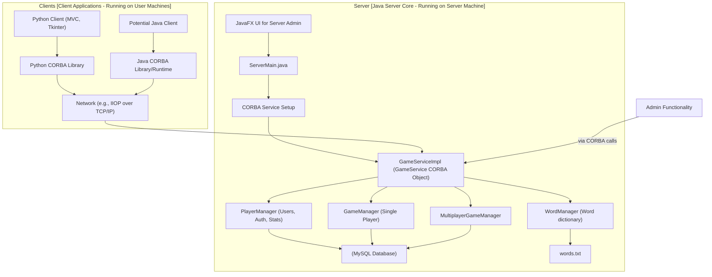
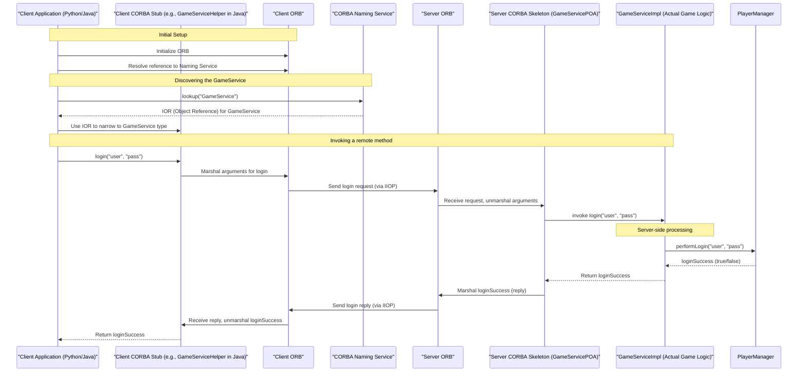

# Hangman Project: Reviewer's Guide

## 1. Introduction

This document provides a comprehensive technical overview of the Hangman game project. The game supports both single-player and multiplayer modes and features a client-server architecture with CORBA for communication. It is designed to explain the project's components, their interactions, and the underlying technologies to a reviewer or developer.

## 2. High-Level Architecture

The Hangman game is built upon a **client-server model**.

*   **Server:** A Java-based application responsible for all game logic, player management, and data persistence. It exposes its services via CORBA.
*   **Clients:**
    *   **Python Client:** A desktop application built using Python (likely with Tkinter for the GUI and an MVC pattern) that interacts with the Java server.
    *   **Potential Java Client:** The codebase suggests the existence or plan for a Java-based client as well.
*   **Communication Protocol:** CORBA (Common Object Request Broker Architecture) is the middleware enabling communication between the distributed client and server components.
*   **Database:** MySQL is used for persisting player data, game statistics, and match history.



## 3. CORBA Communication Deep Dive

CORBA is a standard defined by the Object Management Group (OMG) designed to facilitate communication of systems that are deployed on diverse platforms. It enables objects to call each other across a network as if they were local objects.

### 3.1. Role in this Project

In the Hangman game, CORBA serves as the bridge between the Java-based server and potentially diverse clients (like the Python client). It allows the client applications to invoke methods on the `GameServiceImpl` object running on the server machine, abstracting away the network communication details.

### 3.2. Key CORBA Concepts Used

1.  **IDL (Interface Definition Language):**
    *   A language used to define the interface of the remote service (i.e., the methods a client can call). In this project, there would be an IDL file (e.g., `GameService.idl` - contents not directly viewed but its presence is inferred from `GameModule` and POA classes) that defines the operations like `login`, `startGame`, `sendGuess`, etc.
    *   This IDL contract is compiled to generate:
        *   **Client Stubs:** Code in the client's language (e.g., Python, Java) that acts as a proxy for the remote server object. When the client calls a method on the stub, the stub marshals (packs) the arguments and sends them to the server.
        *   **Server Skeletons (POA - Portable Object Adapter based):** Code in the server's language (Java) that receives requests from clients, unmarshals arguments, calls the actual server implementation (`GameServiceImpl`), and marshals the results back to the client. `GameServicePOA.java` is an example of such a skeleton.

2.  **ORB (Object Request Broker):**
    *   The ORB is the runtime library that handles the communication. Both client and server have an ORB.
    *   It's responsible for finding remote objects, marshalling/unmarshalling data, and managing the underlying network protocol (typically IIOP - Internet Inter-ORB Protocol).
    *   `ServerMain.java` explicitly initializes an ORB (`ORB.init(...)`). The Python client would also initialize its ORB using a Python CORBA library.

3.  **Naming Service:**
    *   A standard CORBA service that allows servers to register remote objects with a human-readable name and clients to look them up.
    *   In `ServerMain.java`, after creating the `GameServiceImpl` object and making it a CORBA object, it's registered with the Naming Service (`ncRef.rebind(path, href)` where `name = "GameService"`).
    *   Clients query the Naming Service to get a reference (IOR - Interoperable Object Reference) to the "GameService" object.

### 3.3. Typical Request-Response Flow (e.g., Client Login)



## 4. Server-Side Breakdown (`src/main/java/`)

The Java server is the core of the application, handling all game logic, player data, and administrative functions.

### 4.1. `ServerMain.java`

*   **Role:** The main entry point for the server application.
*   **How it Works:**
    1.  **JavaFX UI Initialization:** It sets up a JavaFX GUI (defined in FXML files like `/server/view/ServerMainView.fxml`). This UI is primarily for server administration, allowing an operator to see logs, start/stop the server, and view basic statistics.
    2.  **CORBA Service Setup (`startServer()` method):**
        *   Initializes the CORBA ORB.
        *   Gets a reference to the RootPOA (Portable Object Adapter), which manages CORBA object lifecycles.
        *   Activates the POA Manager.
        *   Creates an instance of `GameServiceImpl`. This is the actual Java object that will handle client requests.
        *   Connects the `GameServiceImpl` to the server UI for logging messages.
        *   Converts the `GameServiceImpl` instance into a CORBA object reference (`rootPOA.servant_to_reference(gameService)`).
        *   Obtains a reference to the CORBA Naming Service.
        *   Binds the `GameService` object reference to the name "GameService" in the Naming Service, making it discoverable by clients.
    3.  **ORB Execution:** Starts the ORB in a new thread (`orb.run()`). The ORB then listens for incoming client requests.
    4.  **Server Control:** Provides methods like `stopServer()` to shut down the ORB and `getGameService()` to access the game service instance locally (primarily for the UI controller).

### 4.2. `server.handler.GameServiceImpl.java`

*   **Role:** This is the powerhouse of the server. It's the concrete implementation of the `GameService` interface defined in the IDL (it extends `GameServicePOA`). All client interactions pass through this class.
*   **How it Works:**
    *   **CORBA Method Implementation:** Implements all the methods defined in the `GameService` IDL (e.g., `login`, `startGame`, `sendGuess`, `getGameState`, `addWord`, `getMultiplayerLobbyState`, etc.).
    *   **Delegation:** It doesn't contain all the logic itself. Instead, it delegates tasks to specialized manager classes:
        *   `PlayerManager`: For user authentication, account management, leaderboard, etc.
        *   `WordManager`: For managing the dictionary of words.
        *   `GameManager`: For handling single-player game logic.
        *   `MultiplayerGameManager`: For handling multiplayer game logic and lobbies.
    *   **Data Transfer Object (DTO) Mapping:** When receiving data from clients or sending data back, it often converts between internal server DTOs (e.g., `server.dto.GameStateDTO`) and the CORBA-specific DTOs generated from the IDL (e.g., `GameModule.GameStateDTO`).
    *   **Database Interaction:** Initializes and uses DAO objects (`MatchResultDAO`, `SinglePlayerMatchResultDAO`) for persisting and retrieving game history. Also directly instantiates these DAOs with JDBC connection strings (MySQL).
    *   **Multiplayer State Serialization:** The `getMultiplayerLobbyState` method manually constructs a JSON string representing the lobby and game state. This is a bit unusual for a CORBA service (which typically relies on IDL-defined structs) and could be an area for refactoring to use IDL structs or a more robust JSON library if the structure is complex.

### 4.3. `server.handler.PlayerManager.java` (and related DB interactions)

*   **Role:** Manages all aspects related to players.
*   **How it Works:**
    *   **Player CRUD:** Handles creation, retrieval, update (password, username, wins), and deletion of player accounts.
    *   **Authentication:** Verifies username and password during login (likely querying the database).
    *   **Session Management (Implicit):** Tracks logged-in players to prevent multiple logins (`AlreadyLoggedInException`).
    *   **Leaderboard:** Calculates and provides leaderboard data (likely by querying player wins from the database).
    *   **System Statistics:** Gathers overall game statistics.
    *   **Settings Management:** Updates and retrieves game settings like waiting time and round time.
    *   **Database Interaction:** Persists player information in the MySQL database. SQL queries for these operations would be defined within this class or a dedicated PlayerDAO (though DAOs seem to be mainly for match results).

### 4.4. `server.handler.WordManager.java`

*   **Role:** Manages the dictionary of words used in the game.
*   **How it Works:**
    *   **Word Source:** Loads words from a text file (`words.txt` at the root of the project seems to be the source, though the loading mechanism isn't detailed in the `GameServiceImpl` constructor, it's a common pattern).
    *   **Word Operations:** Provides methods to add, update, delete, and retrieve words. These are likely admin-level functions.
    *   **Random Word Selection:** Supplies random words to the `GameManager` and `MultiplayerGameManager` when new games or rounds start.

### 4.5. `server.handler.GameManager.java` (Single-Player)

*   **Role:** Manages the lifecycle and state of single-player Hangman games.
*   **How it Works:**
    *   **Game Initialization (`startGame`):**
        *   Associates a game with a player.
        *   Fetches a random word from `WordManager`.
        *   Initializes game parameters (e.g., attempts, masked word).
    *   **Guess Processing (`sendGuess`):**
        *   Validates the guess.
        *   Updates the masked word if correct.
        *   Decrements attempts if incorrect.
        *   Checks for win/loss conditions.
    *   **State Management:** Tracks the current state of each active single-player game (masked word, incorrect guesses, remaining time, round status, etc.). This state is often encapsulated in `server.dto.GameStateDTO`.
    *   **Round Logic:** Manages rounds, including starting new rounds and determining round outcomes.
    *   **Timing:** Manages round timers.
    *   **Game Conclusion:** Records game results via `SinglePlayerMatchResultDAO`.

#### 4.5.1. Single-Player Game Flow Diagram

```mermaid
sequenceDiagram
    participant ClientApp as "Client (e.g., Python UI)"
    participant ClientModel as "Client Model (Handles CORBA)"
    participant GameService as "Server (GameServiceImpl via CORBA)"
    participant GameManager as "GameManager (Server-Side Logic)"
    participant WordManager as "WordManager (Server-Side)"
    participant SP_DAO as "SinglePlayerMatchResultDAO (Server-Side DB)"

    ClientApp->>ClientModel: User clicks "Start Single-Player Game"
    ClientModel->>GameService: startGame(username)
    GameService->>GameManager: startGame(username)
    GameManager->>WordManager: getRandomWord()
    WordManager-->>GameManager: "SECRETWORD"
    GameManager->>GameManager: Initialize game (maskedWord: "________", attemptsLeft: N)
    GameManager-->>GameService: Initial GameStateDTO (masked: "________", ...)
    GameService-->>ClientModel: GameStateDTO
    ClientModel-->>ClientApp: Update UI (display masked word, attempts)

    loop While game in progress
        ClientApp->>ClientModel: User guesses letter 'S'
        ClientModel->>GameService: sendGuess(username, 'S')
        GameService->>GameManager: sendGuess(username, 'S')
        GameManager->>GameManager: Process guess (update maskedWord: "S_______S", update attempts)
        GameManager-->>GameService: Updated GameStateDTO
        GameService-->>ClientModel: GameStateDTO
        ClientModel-->>ClientApp: Update UI (display "S_______S")

        alt Game Won/Lost
            GameManager->>GameManager: Determine game outcome (Win/Loss)
            GameManager->>SP_DAO: saveMatchResult(username, outcome, score, etc.)
            SP_DAO-->>GameManager: Confirmation
            GameManager-->>GameService: Final GameStateDTO (gameOver=true, result="Win/Loss")
            GameService-->>ClientModel: GameStateDTO
            ClientModel-->>ClientApp: Display "You Win!" / "Game Over!"
            break
        end
    end
    
    ClientApp->>ClientModel: User might explicitly end session (or handled by server)
    ClientModel->>GameService: endGameSession(username)
    GameService->>GameManager: endGameSession(username)
    GameManager->>GameManager: Cleanup game session for player
    GameManager-->>GameService: Confirmation (if any)
    GameService-->>ClientModel: Confirmation
```

### 4.6. `server.handler.MultiplayerGameManager.java`

*   **Role:** Manages multiplayer game lobbies, synchronization, and game progression.
*   **How it Works:**
    *   **Lobby Management:**
        *   Allows players to join or create lobbies (`joinOrCreateLobby`).
        *   Tracks players within a lobby.
        *   Manages lobby state (waiting, started).
        *   Handles queue times and player counts (min/max).
    *   **Game Synchronization:** Ensures all players in a lobby have a consistent view of the game (e.g., same word, synchronized round starts).
    *   **Shared Game State:** Manages the shared state for a multiplayer game, including the current word (potentially same for all or per-player if variations exist), scores for all players, guesses made by each player.
    *   **Turn/Guess Handling (`makeGuess`):** Processes guesses from multiple players, updates individual and shared game states.
    *   **Round Progression (`startNextRound`):** Coordinates the start of new rounds for all players in the lobby.
    *   **Winner Determination:** Determines round winners and overall game winners based on scores or other criteria.
    *   **Cleanup:** Manages cleanup of finished games/lobbies.
    *   **Stall Detection:** Includes logic for detecting and potentially handling stalled games (e.g., if a player doesn't make a move).
    *   **Match History:** Interacts with `MatchResultDAO` to save multiplayer game results.

#### 4.6.1. Multiplayer Game Flow Diagram

```mermaid
sequenceDiagram
    participant Client1App as "Player1 Client"
    participant Client1Model as "Player1 Model (CORBA)"
    participant Client2App as "Player2 Client"
    participant Client2Model as "Player2 Model (CORBA)"
    participant GameService as "Server (GameServiceImpl via CORBA)"
    participant MP_Manager as "MultiplayerGameManager (Server Logic)"
    participant WordManager as "WordManager (Server)"
    participant MP_DAO as "MatchResultDAO (Server DB)"

    Note over Client1App, Client2App: Players decide to play multiplayer

    Client1App->>Client1Model: User clicks "Join/Create Multiplayer Game"
    Client1Model->>GameService: startMultiplayerGame(username1)
    GameService->>MP_Manager: joinOrCreateLobby(username1)
    MP_Manager-->>GameService: lobbyId_XYZ
    GameService-->>Client1Model: lobbyId_XYZ
    Client1Model-->>Client1App: Display "Waiting in lobby XYZ..."

    Client2App->>Client2Model: User clicks "Join/Create Multiplayer Game"
    Client2Model->>GameService: startMultiplayerGame(username2)
    GameService->>MP_Manager: joinOrCreateLobby(username2) (joins existing or creates new)
    MP_Manager-->>GameService: lobbyId_XYZ
    GameService-->>Client2Model: lobbyId_XYZ
    Client2Model-->>Client2App: Display "Waiting in lobby XYZ..."

    loop Lobby Waiting / Game State Polling
        Client1App->>Client1Model: Request lobby update
        Client1Model->>GameService: getMultiplayerLobbyState(username1)
        GameService->>MP_Manager: getLobbyByPlayer(username1) / getGameState(username1)
        MP_Manager-->>GameService: JSON Lobby/Game State (players, status, scores, etc.)
        GameService-->>Client1Model: JSON State
        Client1Model-->>Client1App: Update UI (show players, game status)

        Client2App->>Client2Model: Request lobby update
        Client2Model->>GameService: getMultiplayerLobbyState(username2)
        GameService-->>Client2Model: JSON Lobby/Game State
        Client2Model-->>Client2App: Update UI
    end

    Note over MP_Manager: Lobby full or timer expires, game starts
    MP_Manager->>WordManager: getRandomWord()
    WordManager-->>MP_Manager: "MULTIPLAYERSECRET"
    MP_Manager->>MP_Manager: Initialize shared game state for lobby XYZ

    Note over Client1App, Client2App: Clients see game started via getMultiplayerLobbyState
    Client1App->>Client1Model: Player 1 ready for first round
    Client1Model->>GameService: playerReadyForFirstRound(username1)
    GameService->>MP_Manager: playerReadyForFirstRound(username1)
    
    Client2App->>Client2Model: Player 2 ready for first round
    Client2Model->>GameService: playerReadyForFirstRound(username2)
    GameService->>MP_Manager: playerReadyForFirstRound(username2)

    Note over MP_Manager: All (or enough) players ready, first round starts
    MP_Manager->>MP_Manager: Start round, set timer, current word for all.

    loop Round in Progress
        Note over Client1App, Client2App: UI shows masked word for "MULTIPLAYERSECRET"
        Client1App->>Client1Model: Player1 guesses 'M'
        Client1Model->>GameService: sendMultiplayerGuess(username1, 'M')
        GameService->>MP_Manager: makeGuess(username1, 'M')
        MP_Manager->>MP_Manager: Update game state (Player1 score, common masked word)

        Client2App->>Client2Model: Player2 guesses 'T'
        Client2Model->>GameService: sendMultiplayerGuess(username2, 'T')
        GameService->>MP_Manager: makeGuess(username2, 'T')
        MP_Manager->>MP_Manager: Update game state (Player2 score, common masked word)
        
        Note over Client1App, Client2App: Clients poll getMultiplayerLobbyState for updates
        Client1Model->>GameService: getMultiplayerLobbyState(username1)
        GameService-->>Client1Model: Updated JSON (masked word, scores, etc.)
        Client1Model-->>Client1App: Refresh UI

        alt Round Over (word guessed / time up / all failed)
            MP_Manager->>MP_Manager: Determine round winner(s), update scores
            Note over Client1App, Client2App: Clients see round over via getMultiplayerLobbyState
            
            alt More Rounds to Play
                Client1App->>Client1Model: Player1 clicks "Start Next Round" (or auto-triggered)
                Client1Model->>GameService: startMultiplayerNextRound(username1)
                GameService->>MP_Manager: startNextRound(username1) (if conditions met)
                MP_Manager->>WordManager: getRandomWord()
                WordManager-->>MP_Manager: "NEXTSECRET"
                MP_Manager->>MP_Manager: Initialize next round
            else Game Over (all rounds played / target score reached)
                MP_Manager->>MP_Manager: Determine overall game winner(s)
                MP_Manager->>MP_DAO: saveMultiplayerMatchResult(lobbyId_XYZ, player_scores, winner, etc.)
                MP_DAO-->>MP_Manager: Confirmation
                Note over Client1App, Client2App: Clients see game over and final results via getMultiplayerLobbyState
                break
            end
        end
    end
```

### 4.7. `server.db.*DAO.java` (e.g., `MatchResultDAO`, `SinglePlayerMatchResultDAO`)

*   **Role:** Data Access Objects responsible for all direct database interactions related to match history.
*   **How it Works:**
    *   **JDBC:** Uses Java Database Connectivity (JDBC) to connect to the MySQL database (connection details are hardcoded in `GameServiceImpl` when DAOs are instantiated).
    *   **SQL Execution:** Contains methods that execute SQL queries (SELECT, INSERT, UPDATE, DELETE) to store and retrieve game summary and detailed game data.
    *   **DTO Mapping:** Maps database result sets to/from DTOs (e.g., `server.dto.MultiplayerGameSummaryDTO`).

### 4.8. `server.dto/*.java`

*   **Role:** Data Transfer Objects used internally within the server to pass structured data between different layers (e.g., between managers and DAOs, or within `GameServiceImpl`).
*   **How it Works:** Simple Plain Old Java Objects (POJOs) with fields and getter/setter methods. These are distinct from the CORBA DTOs in `GameModule/` which are generated from IDL. `GameServiceImpl` often bridges these two types of DTOs.

### 4.9. Admin Functionalities

*   **Exposure:** Admin functions (like adding words via `WordManager.addWord`, updating system settings via `PlayerManager.updateSettings`) are exposed as methods in `GameServiceImpl`.
*   **Access:** An administrator would need a client capable of making CORBA calls to these specific methods. This could be a dedicated admin UI (part of the JavaFX server UI or a separate client) or a command-line tool. The server-side JavaFX application (`ServerMainController`) itself acts as a form of admin client to the `GameServiceImpl` for logging and basic server control.

## 5. Python Client Breakdown (`python_client/`)

The Python client provides a graphical interface for users to play the Hangman game.

### 5.1. Architecture (MVC)

The client follows a Model-View-Controller pattern:

*   **Model (`models/game_model.py` - presumed):** Handles the game's data, logic on the client side, and, most importantly, all communication with the Java server via CORBA.
*   **View (`views/main_view.py` - `HangmanApp`, likely Tkinter):** Responsible for rendering the user interface and displaying game information.
*   **Controller (`controllers/game_controller.py` - presumed):** Acts as the intermediary, responding to user input from the View by updating the Model, and updating the View when the Model changes.

### 5.2. `app.py`

*   **Role:** The main entry point for the Python client application.
*   **How it Works:**
    1.  Initializes the `GameModel`.
    2.  Initializes the `HangmanApp` (View).
    3.  Initializes the `GameController`, passing it references to the Model and View.
    4.  Connects the View back to the Controller (e.g., `view.controller = controller`).
    5.  Calls a method on the controller (e.g., `controller.start()`) to launch the application and its main UI loop.

### 5.3. `models/game_model.py` (Presumed Functionality)

*   **Role:** Manages client-side game state and server communication.
*   **How it Works:**
    1.  **CORBA Setup:**
        *   Initializes a Python CORBA ORB (e.g., using a library like `omniORBpy` or `PyRO`).
        *   Looks up the "GameService" object from the Naming Service (similar to how the Java server registers it). This gives the model a proxy object for the remote `GameServiceImpl`.
    2.  **Server Interaction:** Contains methods that mirror the actions a user can take (e.g., `login(username, password)`, `send_guess(letter)`, `start_game()`). When these methods are called (by the Controller):
        *   They invoke the corresponding methods on the CORBA proxy object.
        *   This triggers a CORBA call to the Java server.
        *   They receive the response from the server (e.g., updated game state, login status) and update the client-side game state.
    3.  **State Management:** Holds the current game state as perceived by the client (e.g., masked word, incorrect guesses, player score, logged-in status). This state is updated based on responses from the server.

### 5.4. `views/main_view.py` (Presumed `HangmanApp` with Tkinter)

*   **Role:** Renders the game's user interface.
*   **How it Works:**
    *   **UI Elements:** Uses Tkinter (a common Python GUI library) widgets to create windows, buttons (for letters, actions like "Start Game"), labels (for masked word, scores, messages), entry fields (for login/password), etc. The `eye.png` file suggests graphical elements.
    *   **Displaying Data:** Fetches data from the Model (via the Controller or direct read access if designed that way) and updates the UI elements to reflect the current game state.
    *   **User Input:** Captures user actions (button clicks, text input) and forwards these events to the `GameController`.

### 5.5. `controllers/game_controller.py` (Presumed Functionality)

*   **Role:** Orchestrates interactions between the View and the Model.
*   **How it Works:**
    1.  **Event Handling:** Receives user action notifications from the View (e.g., "user clicked letter 'A'", "user clicked login button").
    2.  **Model Interaction:** Calls appropriate methods on the `GameModel` to process the action (e.g., `model.send_guess('A')`, `model.login(username, password)`).
    3.  **View Updates:** After the Model processes the action and its state (potentially) changes (e.g., due to a server response), the Controller is responsible for telling the View to refresh or update specific parts of the UI. This can be done by calling methods on the View or through an observer pattern where the View listens for changes in the Model.
    4.  **Application Flow:** Manages transitions between different views or states of the application (e.g., from login screen to game screen).

## 6. Potential Java Client (`client/player/` and `src/main/java/client/`)

While not fully explored, the directory structure suggests a Java-based client.

*   **How it would work:**
    *   Similar to the Python client, it would use Java's CORBA capabilities (either built-in JRE ORB or a library like OpenORB/JacORB).
    *   It would look up the `GameService` from the Naming Service.
    *   It would likely have its own UI (Swing or JavaFX) and internal logic to call methods on the remote `GameService` object.
    *   The classes in `GameModule/` (like `GameServiceHelper.java`, `GameStateDTO.java` etc.) are the Java stubs and data types generated from the IDL, which this Java client would use directly.

## 7. Database (MySQL)

*   **Role:** Persistent storage for player accounts, game statistics, and detailed match history for both single and multiplayer games.
*   **Interaction:** The Java server interacts with MySQL via JDBC, primarily through the DAO classes.
*   **Schema (Conceptual based on code):**
    *   `Players` table: `username`, `password_hash`, `wins`, `other_stats`.
    *   `SinglePlayerMatchHistory` table: `game_id`, `player_username`, `word`, `won`, `score`, `timestamp`, `guesses_made`, `time_taken`.
    *   `MultiplayerMatchHistory` table: `game_id` (lobby_id), `timestamp`.
    *   `MultiplayerMatchPlayers` or similar: `game_id`, `player_username`, `score`, `is_winner`.
    *   The `words.txt` file acts as the primary source for game words, not a database table, though words are managed via `WordManager`.
*   The `orb.db/` directory in the project root is likely related to a local ORB's persistence needs (like storing IORs or transaction logs if using certain CORBA services) or might be a remnant of an older database attempt (e.g., an embedded DB like Derby or HSQLDB before switching to MySQL). The primary game data persistence is clearly via MySQL as per `GameServiceImpl` and `pom.xml`.

## 8. Build and Run Process

*   **Server (Java):**
    1.  **Build:** The project is a Maven project. Building it (e.g., `mvn package`) would compile the Java code and package it (likely into a JAR).
    2.  **Run:** The `run_server.bat` script is used. This script likely:
        *   Sets up the classpath.
        *   Runs the `server.ServerMain` class.
        *   May pass Java system properties if needed for CORBA (e.g., ORB listening port, Naming Service location if not default).
*   **Python Client:**
    1.  **Dependencies:** Requires Python and a Python CORBA library (e.g., `omniORBpy`). The `python_client/requirements.txt` might list this and other dependencies like `customtkinter`.
    2.  **Run:** The `run_client.bat` script is used. This script likely executes `python python_client/app.py`.
*   **Database Setup:** MySQL server must be running and configured with the database/tables expected by the server (database name `game`, user `root`, empty password, as per `GameServiceImpl` defaults).

## 9. Key Interaction Summary with CORBA

*   **Player Login:**
    1.  Client (Python/Java) UI captures username/password.
    2.  Client Controller calls Model's login method.
    3.  Client Model uses CORBA stub to call `login(username, password)` on remote `GameService` object.
    4.  CORBA ORBs handle network transmission.
    5.  Server ORB delivers call to `GameServiceImpl.login()`.
    6.  `GameServiceImpl` delegates to `PlayerManager` (which checks DB).
    7.  Response (success/failure, player data) travels back via CORBA.
    8.  Client Model updates, Controller updates UI.

*   **Starting a Game (Single Player - see section 4.5.1 for detailed flow):**
    1.  Client UI triggers "Start Game".
    2.  Controller -> Model -> CORBA call to `GameServiceImpl.startGame(username)`.
    3.  `GameServiceImpl` delegates to `GameManager`.
    4.  `GameManager` gets word from `WordManager`, sets up initial state.
    5.  Initial `GameStateDTO` (CORBA version) sent back to client.
    6.  Client UI displays masked word, etc.

*   **Making a Guess (Single Player - see section 4.5.1 for detailed flow):**
    1.  Client UI captures letter guess.
    2.  Controller -> Model -> CORBA call to `GameServiceImpl.sendGuess(username, letter)`.
    3.  `GameServiceImpl` delegates to `GameManager`.
    4.  Game logic updates state (masked word, attempts).
    5.  Updated `GameStateDTO` sent back to client.
    6.  Client UI refreshes.

*   **Multiplayer Interactions (see section 4.6.1 for detailed flow):**
    *   Joining/Creating Lobbies: `startMultiplayerGame(username)`
    *   Getting Lobby/Game State: `getMultiplayerLobbyState(username)`
    *   Signaling Readiness: `playerReadyForFirstRound(username)`
    *   Making Guesses: `sendMultiplayerGuess(username, letter)`
    *   Starting Next Round: `startMultiplayerNextRound(username)`

*   **Admin Adding a Word:**
    1.  Admin Client UI captures new word.
    2.  Admin Client makes CORBA call to `GameServiceImpl.addWord(word)`
    3.  `GameServiceImpl` delegates to `WordManager.addWord()`.
    4.  `WordManager` updates its internal list and/or `words.txt`.
    5.  Confirmation sent back via CORBA.

This guide should provide a solid foundation for understanding the Hangman project's architecture and operation. 